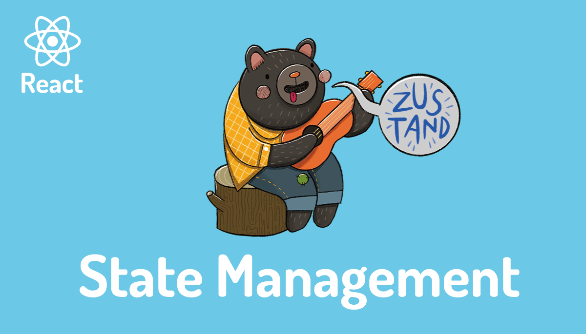
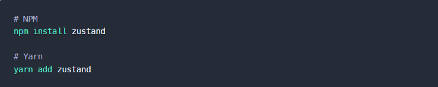

# Zustand

# What is Zustand ?

A small, fast, and scalable bearbones state management solution. Zustand has a comfy API based on hooks. It isn't boilerplatey or opinionated, but has enough convention to be explicit and flux-like.

Don't disregard it because it's cute, it has claws! Lots of time was spent to deal with common pitfalls, like the dreaded zombie child problem, React concurrency, and context loss between mixed renderers. It may be the one state manager in the React space that gets all of these right.

# Installation

Zustand is available as a package on NPM for use:

# For more infomation please visit the documentation at:
https://docs.pmnd.rs/zustand/getting-started/introduction

